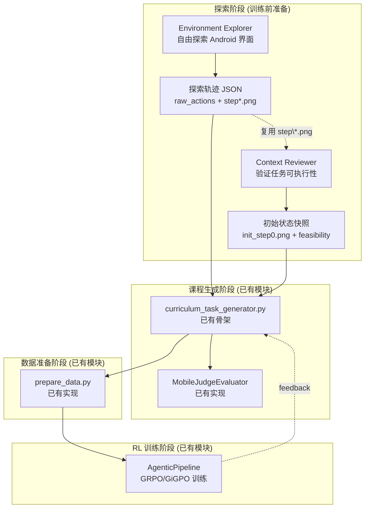

# Exploration 模块初版设计方案

> 本文档面向将 ACuRL 框架的"环境探索 (Environment Exploration)"与"上下文审查 (Context Review)"功能迁移到 ROLL 项目 AndroidWorld/MobileWorld 训练体系，设计一套 `roll/pipeline/agentic/env/android/exploration/` 模块。

---

## 1. 总体架构设计

### 1.1 模块在 ROLL 自进化链路中的定位



### 1.2 探索模块目录结构

```
roll/pipeline/agentic/env/android/exploration/
├── __init__.py
├── explorer.py              # 环境探索器：自由探索 Android 界面，记录动作序列和截图
├── context_reviewer.py     # 上下文审查器：验证任务可执行性，建立初始状态快照
├── snapshot_manager.py      # OpenMobile 风格的 Params 持久化 + App 快照管理
├── trajectory_formatter.py  # 轨迹格式化：兼容 curriculum_task_generator.py 的数据契约
├── templates/              # 探索任务模板
│   └── androidworld_exploration.json   # AndroidWorld 自由探索模板
│   └── mobileworld_exploration.json    # MobileWorld 自由探索模板
└── scripts/               # CLI 入口脚本
    ├── run_exploration.sh          # 环境探索脚本入口
    └── run_context_review.sh       # 上下文审查脚本入口
```

### 1.3 与现有模块的依赖关系

```
exploration 模块依赖关系:

explorer.py
  └─ remote_android.py / remote_mobileworld.py  (已实现: HTTP API 调用 /reset /step /screenshot)
  └─ android.py                                  (已实现: 动作空间转换 convert_action_space)
  └─ mobile/mobilejudge.py                       (已实现: 轨迹评判)
  └─ curriculum_task_generator.py                (已实现: 轨迹数据加载方法)

context_reviewer.py
  └─ remote_android.py / remote_mobileworld.py  (已实现: /init 任务初始化)
  └─ snapshot_manager.py                        (新增: App 快照恢复)
  └─ android_step_env_manager.py                 (参考: format_messages / system prompt)
  └─ mobile/mobilejudge.py                       (可选: 可行性评估)

snapshot_manager.py (新增，核心依赖 OpenMobile 逻辑)
  └─ AndroidWorld app_snapshot.py 逻辑         (复用: restore_snapshot / save_snapshot)
  └─ OpenMobile params 持久化                  (复用: generate_random_params / pickle 保存加载)

trajectory_formatter.py (新增)
  └─ curriculum_task_generator.py 已有方法        (复用: load_trajectory_data / get_screenshots_from_folder)
```

### 1.4 核心设计原则

1. **非侵入性**：探索模块独立于训练主链路（`AgenticPipeline`、`RolloutScheduler`），仅在训练前运行
2. **数据可复用**：探索产物（轨迹 JSON + 截图）直接作为 `curriculum_task_generator.py` 的输入，无需格式转换
3. **上下文审查适配**：参考 OpenMobile 的 Params + App 快照机制替代 ACuRL 中基于文件验证的 Context Review
4. **兼容双环境**：同时支持 AndroidWorld（桌面端控制 Android 模拟器）和 MobileWorld（远端 Android 设备）

---

## 2. 功能迁移思路

### 2.1 环境探索 (Environment Exploration) 迁移

#### 2.1.1 ACuRL 原有机制回顾

| 维度 | ACuRL Desktop 机制 |
|------|-------------------|
| 探索入口 | `environment_exploration.sh` → `environment_exploration.json` 任务 |
| 环境类型 | OSWorld DesktopEnv（pyautogui 动作空间） |
| 轨迹保存 | `rollout_loop.py` 的 episode 保存机制自动落盘 `trajectories/*.json` |
| CUAJudge | 关闭（探索阶段不评估） |
| max_steps | 50（充分探索） |

#### 2.1.2 迁移到 AndroidWorld/MobileWorld 的适配

**核心差异**：

| 维度 | Desktop (ACuRL) | AndroidWorld (本模块) | MobileWorld (本模块) |
|------|-----------------|----------------------|---------------------|
| 环境协议 | OSWorld DesktopEnv | AndroidWorld gRPC + HTTP | MobileWorld HTTP API |
| 动作空间 | pyautogui（拖拽/缩放等） | json_action（click/swipe/type/open/answer 等） | mobile_use（click/long_press/swipe/type/terminate 等） |
| 轨迹保存 | rollout_loop.py 自动保存 | `explorer.py` 内手动保存 | 同左 |
| 截图获取 | 每步自动截图 | `/step` 返回 `observation` | `/step` 返回 `screenshot_b64` |

**迁移要点**：

1. **不复用 `rollout_loop.py`**：探索阶段的交互模式（无限探索、不更新策略、不调用 judge）与训练阶段有本质差异，新增专用 `MobileWorldExplorer` / `AndroidWorldExplorer` 避免破坏训练逻辑
2. **复用 `RemoteAndroidEnv` / `RemoteMobileEnv`**：两者已实现完整的 `/reset` / `/step` / `/screenshot` HTTP 协议，复用其作为底层执行后端
3. **复用 `android.py` 的动作转换**：`convert_action_space()` 已实现 Qwen-VL 动作空间 → AndroidWorld 动作空间的转换，探索器直接复用
4. **新增探索模板**：`templates/androidworld_exploration.json` 定义探索 instruction，与 AndroidWorld 的任务系统绑定

#### 2.1.3 探索结果数据格式

与 ACuRL 保持兼容，确保可直接被 `curriculum_task_generator.py` 消费：

```json
// {output_dir}/{exploration_id}/trajectory.json
{
    "id": "exploration_androidworld_001",
    "timestamp": "2026-04-26T10:00:00Z",
    "env_type": "android_world",           // "android_world" | "mobile_world"
    "model": "Qwen3-VL-2B",
    "max_steps": 50,
    "actual_steps": 47,
    "raw_actions": [                      // 供 curriculum_task_generator 使用（与 ACuRL 格式一致）
        "click at (540, 120)",
        "type 'flight mode'",
        "press_back",
        ...
    ],
    "screenshots": [                     // 供 curriculum_task_generator 使用（与 ACuRL 格式一致）
        "step0.png",
        "step1.png",
        ...
    ],
    "actions_detailed": [                 // 内部扩展字段
        {
            "step": 1,
            "raw": "click at (540, 120)",
            "parsed": {"action": "click", "x": 540, "y": 120},
            "result": "success",
            "app_before": "Settings",
            "app_after": "Settings > Network"
        },
        ...
    ],
    "discovered_apps": ["Settings", "Camera", "Chrome", "Phone"],
    "discovered_actions": ["click", "type", "swipe", "long_press", "home", "back"]
}
```

### 2.2 上下文审查 (Context Review) 迁移

#### 2.2.1 ACuRL 原有机制回顾

| 维度 | ACuRL Desktop 机制 |
|------|-------------------|
| 目的 | 验证任务可执行性，建立初始状态快照 |
| 验证内容 | config（下载文件）+ evaluator（比对结果） |
| 产物 | `context_review/training_step_0/<uid>/step0.png` |
| max_steps | 20（只需导航到初始状态） |

#### 2.2.2 迁移到 AndroidWorld/MobileWorld 的核心挑战

ACuRL 的 Context Review 依赖 Desktop 环境的"文件初始化"机制（config 下载/上传、evaluator 比对文件内容），AndroidWorld/MobileWorld 不具备这一机制。需要用 OpenMobile 的方案替代。

**OpenMobile 的解决方案**（参考 `E:\code\GUI\OpenMobile-Code\docs\reset_task.md`）：

```
┌────────────────────────────────────────────────────────────────────────┐
│ OpenMobile Params 持久化 + App 快照机制                                 │
│                                                                        │
│ 探索阶段:                                                             │
│   1. task_type.generate_random_params() → 生成随机参数                  │
│   2. 保存 params 到 {task_uuid}_params.pkl                            │
│   3. 执行随机游走，记录 (screen_before, action, screen_after)           │
│                                                                        │
│ 合成任务阶段:                                                          │
│   4. 通过 screen 路径回填 task_id 到合成任务 JSON                       │
│                                                                        │
│ Rollout 阶段:                                                         │
│   5. 加载 {task_id}_params.pkl                                        │
│   6. task.initialize_task(env)                                        │
│      └─ app_snapshot.restore_snapshot(app_name) 恢复 App 数据            │
│      └─ 重新生成与探索时相同的测试数据                                  │
│   7. run_episode(goal=instruction)                                   │
└────────────────────────────────────────────────────────────────────────┘
```

#### 2.2.3 本模块的 Context Review 语义适配

| ACuRL Desktop 验证 | AndroidWorld 替代方案 | MobileWorld 替代方案 |
|--------------------|-----------------------|----------------------|
| 验证文件可下载/打开 | 调用 `/init` 初始化任务，验证 `observation` 返回正常 | 调用 `/reset` 初始化任务，验证 `screenshot_b64` 返回正常 |
| 验证初始状态正确 | App 快照恢复 (`app_snapshot.restore_snapshot`) | AndroidWorld 端已处理，MobileWorld 通过 `/init` 确保干净状态 |
| 建立初始截图锚点 | 保存 `init_step0.png` | 保存 `init_step0.png` |
| 评估任务可行性 | 可选：调用 `MobileJudgeEvaluator` 评估初始截图是否包含目标 App | 同左 |

**关键结论**：AndroidWorld/MobileWorld 的 Context Review 核心是**任务初始化验证**（通过 `/init` / `/reset` 确认任务可以建立）+ **初始状态快照保存**（`init_step0.png`），无需像 ACuRL 那样验证文件加载。

#### 2.2.4 上下文审查结果数据格式

```json
// {output_dir}/{task_name}/context_review.json
{
    "task_name": "ContactsAddContact",
    "review_id": "review_001",
    "timestamp": "2026-04-26T10:00:00Z",
    "env_type": "android_world",
    "initialization": {
        "success": true,
        "init_steps_used": 1,
        "task_params": {...},        // 任务初始化参数（来自 MobileWorld task 定义）
        "app_snapshot_restored": true  // OpenMobile 风格的快照恢复标记
    },
    "initial_screenshot": "init_step0.png",
    "feasibility": {
        "checked": false,           // 默认关闭，可通过参数启用 VLM 辅助验证
        "reachable": true,
        "feedback": null
    },
    "discovered_ui_elements": ["FloatingActionButton", "SearchView", "EditText"],
    "blockers": []
}
```

### 2.3 与现有模块的集成方式

```
探索模块 → 课程生成器集成：

exploration/
  ├─ explorer.py ────────────► trajectory.json + step*.png
  │                              └─ curriculum_task_generator.py
  │                                 └─ load_trajectory_data() 已支持
  │
  ├─ context_reviewer.py ─────► context_review.json + init_step0.png
  │                              └─ curriculum_task_generator.py
  │                                 └─ get_context_review_screenshots() 已支持
  │
  └─ snapshot_manager.py ─────► params pickle + app snapshots
                                 └─ RemoteAndroidEnv / RemoteMobileEnv
                                    └─ reset() 时自动恢复快照
```

---

## 3. 代码改动清单

### 3.1 新增文件

#### 3.1.1 `roll/pipeline/agentic/env/android/exploration/__init__.py`

导出核心类和工具函数，供外部调用：

```python
from .explorer import AndroidWorldExplorer, MobileWorldExplorer
from .context_reviewer import AndroidWorldContextReviewer, MobileWorldContextReviewer
from .snapshot_manager import SnapshotManager
from .trajectory_formatter import format_exploration_for_generator, format_context_review_for_generator

__all__ = [
    "AndroidWorldExplorer",
    "MobileWorldExplorer",
    "AndroidWorldContextReviewer",
    "MobileWorldContextReviewer",
    "SnapshotManager",
    "format_exploration_for_generator",
    "format_context_review_for_generator",
]
```

#### 3.1.2 `roll/pipeline/agentic/env/android/exploration/explorer.py`

**核心类**：`AndroidWorldExplorer` / `MobileWorldExplorer`

**职责**：驱动 AndroidWorld/MobileWorld 环境进行无约束自由探索，记录完整动作序列与截图。

**关键方法**：

```python
class BaseExplorer(ABC):
    """探索器基类，定义通用接口"""

    def __init__(
        self,
        service_url: str,
        console_port: int,
        grpc_port: int,
        model_client,                # VLM 推理客户端
        max_steps: int = 50,
        output_dir: str = "./exploration_output",
        screenshot_interval: int = 1,  # 每隔几步截一次图
    ): ...

    def run(self, exploration_id: str, task_name: str = None) -> ExplorationResult:
        """执行一次探索，返回 ExplorationResult"""

    def _build_system_prompt(self) -> str:
        """构建探索系统提示词（适配 AndroidWorld/MobileWorld 动作空间）"""

    def _parse_model_output(self, output: str) -> dict:
        """解析模型输出为结构化动作（复用 android.py 的 convert_action_space）"""

    def _save_trajectory(self, exploration_id: str, history: list) -> str:
        """保存轨迹 JSON（与 ACuRL 格式兼容）"""


class AndroidWorldExplorer(BaseExplorer):
    """AndroidWorld 探索器，复用 RemoteAndroidEnv 的 HTTP 协议"""

    def _do_reset(self, task_name: str):
        return self._call_api(f"{self.service_url}/init", payload)

    def _do_step(self, action: dict):
        return self._call_api(f"{self.service_url}/step", payload)


class MobileWorldExplorer(BaseExplorer):
    """MobileWorld 探索器，复用 RemoteMobileEnv 的 HTTP 协议"""
    # 与 AndroidWorldExplorer 接口一致，底层协议差异封装在子类中
```

**关键设计**：

1. **系统提示词**：专门针对 Android UI 交互设计，强调"不输出 terminate/done"、"持续探索"、"记录动作意图"
2. **动作解析**：直接复用 `android.py` 中的 `convert_action_space()` 将 Qwen-VL 输出转为 AndroidWorld json_action
3. **轨迹保存**：输出 `trajectory.json`（`raw_actions` + `screenshots` 字段），确保与 `curriculum_task_generator.py` 的 `load_trajectory_data()` 兼容
4. **探索模板**：`templates/androidworld_exploration.json` 作为默认任务定义（instruction + snapshot）

#### 3.1.3 `roll/pipeline/agentic/env/android/exploration/context_reviewer.py`

**核心类**：`AndroidWorldContextReviewer` / `MobileWorldContextReviewer`

**职责**：对 AndroidWorld/MobileWorld 任务池进行可行性验证，记录初始状态截图。

**关键方法**：

```python
class BaseContextReviewer(ABC):
    """上下文审查器基类"""

    def __init__(
        self,
        service_url: str,
        console_port: int,
        grpc_port: int,
        max_verify_steps: int = 20,    # 验证步数上限（与 ACuRL 保持一致）
        output_dir: str = "./context_review_output",
        enable_vlm_feasibility: bool = False,  # 是否启用 VLM 辅助验证
        judge_evaluator = None,         # MobileJudgeEvaluator 实例（可选）
    ): ...

    def run(self, task_name: str) -> ContextReviewResult:
        """对单个任务执行上下文审查"""

    def _init_task(self, task_name: str) -> bool:
        """调用 /init 初始化任务，验证是否成功建立"""

    def _capture_initial_screenshot(self) -> str:
        """保存初始截图 init_step0.png"""

    def _check_feasibility(self, initial_screenshot: str, task_goal: str):
        """可选：调用 MobileJudgeEvaluator 做可行性评估"""

    def _save_review_result(self, task_name: str, result: ContextReviewResult):
        """保存审查结果 JSON"""
```

**关键设计**：

1. **初始化验证**：调用 `/init` 验证任务能否正确建立，捕获异常并记录失败原因
2. **初始截图保存**：成功初始化后立即截图，保存为 `init_step0.png`，作为课程生成器的初始状态证据
3. **OpenMobile 快照机制集成**：`snapshot_manager.py` 在初始化阶段自动恢复 App 快照（详见 3.1.4）
4. **与 ACuRL 格式兼容**：输出目录结构 `context_review/{task_name}/context_review.json` 兼容 `curriculum_task_generator.py` 的 `get_context_review_screenshots()` 期望的路径模式

#### 3.1.4 `roll/pipeline/agentic/env/android/exploration/snapshot_manager.py`

**核心类**：`SnapshotManager`

**职责**：实现 OpenMobile 风格的 Params 持久化 + App 快照管理，为探索和审查提供可复现的环境状态。

**关键方法**：

```python
class SnapshotManager:
    """
    管理 AndroidWorld/MobileWorld 环境的 Params 持久化和 App 快照恢复。
    核心逻辑来自 OpenMobile 项目 (E:\code\GUI\OpenMobile-Code\docs\reset_task.md)：
    1. Params 持久化：保存探索时生成的随机参数到 pickle 文件
    2. Task ID 关联：建立探索任务到 Params 文件的映射
    3. App 快照恢复：在任务初始化时自动恢复干净状态
    """

    def __init__(
        self,
        params_dir: str = "./exploration_output/params",
        snapshot_dir: str = "./exploration_output/snapshots",
    ): ...

    def save_params(self, task_id: str, params: dict) -> str:
        """保存探索时的随机参数到 pickle 文件 {task_id}_params.pkl"""

    def load_params(self, task_id: str) -> dict:
        """从 pickle 文件加载参数 {task_id}_params.pkl"""

    def save_app_snapshot(self, app_name: str, env) -> str:
        """
        保存 App 数据快照（对应 OpenMobile 的 app_snapshot.save_snapshot）。
        逻辑：复制 app data 目录到 snapshot_dir/{app_name}/
        """
        # 复用 AndroidWorld app_snapshot.py 的实现逻辑：
        # 1. adb shell pm clear <app_package> 清空当前数据
        # 2. adb pull data/data/<app_package> <snapshot_dir>/<app_name>
        # 3. adb shell restorecon -RD <app_data_path>
        # 4. adb shell chmod 777 -R <app_data_path>

    def restore_app_snapshot(self, app_name: str, env) -> bool:
        """
        恢复 App 数据快照（对应 OpenMobile 的 app_snapshot.restore_snapshot）。
        逻辑：清空当前 app data → 复制快照 → 恢复权限
        """

    def derive_seed(self, task_name: str, instance_id: int = 0) -> int:
        """
        派生确定性 seed（复用 OpenMobile 的 _derive_instance_seed 逻辑）。
        保证相同 task_name + instance_id → 相同 seed → 相同 params
        """
        unique_str = f"{TASK_RANDOM_SEED}_{task_name}_{instance_id}"
        return int(hashlib.sha256(unique_str.encode()).hexdigest(), 16) % (2**32)
```

**关键设计**：

1. **Params 持久化**：探索阶段保存随机参数到 pickle，Rollout 阶段加载相同参数确保状态可复现
2. **确定性 Seed**：使用 `_derive_instance_seed` 保证同一任务的参数可复现
3. **App 快照**：复用 AndroidWorld `app_snapshot.py` 的清空/复制/恢复逻辑
4. **与 RemoteAndroidEnv/RemoteMobileEnv 集成**：在 `reset()` 调用链中插入快照恢复

#### 3.1.5 `roll/pipeline/agentic/env/android/exploration/trajectory_formatter.py`

**职责**：将探索和审查的原始产物格式转换为 `curriculum_task_generator.py` 可以直接消费的标准格式。

**关键函数**：

```python
def format_exploration_for_generator(exploration_dir: str) -> dict:
    """
    将探索目录转换为 curriculum_task_generator 期望的格式。
    返回：
    {
        "trajectory_data": {...},       # load_trajectory_data 兼容
        "screenshots": [...],           # get_environment_exploration_screenshots 兼容
        "actions_text": "..."          # format_environment_exploration_actions 兼容
    }
    """

def format_context_review_for_generator(context_review_dir: str) -> list:
    """
    将上下文审查目录转换为 curriculum_task_generator 期望的截图列表。
    返回：
    [
        {"step": 0, "path": "init_step0.png", "base64": "..."},
        ...
    ]
    """
    # 兼容 curriculum_task_generator.py 的 get_context_review_screenshots() 方法

def natural_sort_key(filename: str) -> list:
    """自然排序（step1.png, step2.png 而非字典序 step1.png, step10.png）"""

def batch_load_explorations(exploration_root_dir: str) -> List[dict]:
    """扫描目录，加载所有 exploration 结果"""
```

#### 3.1.6 `roll/pipeline/agentic/env/android/exploration/templates/androidworld_exploration.json`

```json
{
    "id": "androidworld_free_exploration",
    "snapshot": "android_world.home_screen",
    "instruction": "You have full access to this Android device. Your goal is to explore the current application as thoroughly as possible. Try clicking different UI elements, navigating between screens, entering text, and discovering available actions. Never say 'done' or 'finish' until you have explored at least 40 steps. Cover: app launching, settings navigation, content creation, search, and system interactions if available.",
    "trajectory": "exploration_output/",
    "description": "Free exploration template for AndroidWorld. Model explores Android UI freely."
}
```

#### 3.1.7 `roll/pipeline/agentic/env/android/exploration/scripts/run_exploration.sh`

探索脚本入口，对标 ACuRL 的 `environment_exploration.sh`：

```bash
# 关键参数（对标 ACuRL）：
# --service_url: AndroidWorld/MobileWorld 服务地址
# --env_type: "android_world" | "mobile_world"
# --model_path: 模型路径或 API endpoint
# --max_steps: 探索步数上限（默认 50，与 ACuRL 一致）
# --output_dir: 探索结果输出目录
# --exploration_id: 探索实例唯一标识
# --console_port / --grpc_port: AndroidWorld 端口
```

#### 3.1.8 `roll/pipeline/agentic/env/android/exploration/scripts/run_context_review.sh`

上下文审查脚本入口，对标 ACuRL 的 `context_review.sh`：

```bash
# 关键参数：
# --task_list: 任务名列表（逗号分隔）或 xlsx 文件路径
# --max_verify_steps: 验证步数上限（默认 20，与 ACuRL 一致）
# --enable_vlm_feasibility: 是否启用 VLM 辅助验证（默认 False）
# --output_dir: 审查结果输出目录
```

### 3.2 已有文件改动

#### 3.2.1 `roll/pipeline/agentic/env/android/remote_android.py`

**改动位置**：在 `RemoteAndroidEnv` 类中新增探索模式相关方法。

**改动内容**：

```python
# 新增方法：

def explore_reset(self, task: str = None, go_home: bool = True) -> tuple[np.ndarray, dict]:
    """
    探索专用的 reset。
    与普通 reset 的区别：强制使用 home_screen snapshot，
    确保探索从一致的起点开始。
    """

def explore_step(self, action: dict) -> tuple[np.ndarray, float, bool, None, dict]:
    """
    探索专用的 step。
    与普通 step 的区别：
    - 不计算 reward（探索阶段不评估）
    - 不检查 is_successful
    - 但仍返回截图和 terminate 状态
    """

def get_current_app(self) -> str:
    """
    获取当前前台 App 名称（供 explorer.py 记录 discovered_apps）
    """
```

#### 3.2.2 `roll/pipeline/agentic/env/android/remote_mobileworld.py`

**改动位置**：在 `RemoteMobileEnv` 类中新增探索模式相关方法。

**改动内容**：

```python
# 新增方法（与 remote_android.py 对齐接口）：

def explore_reset(self, target_task: str = None, go_home: bool = True) -> tuple[np.ndarray, dict]:
    """探索专用的 reset，强制从干净状态开始"""

def explore_step(self, action: dict) -> tuple[np.ndarray, float, bool, None, dict]:
    """探索专用的 step，不评估 reward"""

def get_current_app(self) -> str:
    """获取当前 App 名称"""
```

#### 3.2.3 `roll/pipeline/agentic/env/android/mobile/curriculum_task_generator.py`

**改动位置**：在 `MobileSpecificTaskGenerator` 类中新增探索数据加载方法。

**改动内容**：

```python
# 新增方法：

def load_exploration_trajectory(self, exploration_dir: str) -> Dict[str, Any]:
    """
    从 exploration_output/{id}/trajectory.json 加载探索轨迹。
    现有 load_trajectory_data() 已支持此格式，仅需确保字段兼容。
    """

def get_exploration_screenshots(self, exploration_dir: str) -> List[Dict[str, Any]]:
    """
    加载探索截图，返回 [{filename, path, base64, size}, ...]。
    现有 get_environment_exploration_screenshots() 已支持 step*.png 模式，
    探索器的输出路径需要与 templates/androidworld_exploration.json 中的
    trajectory 字段对齐。
    """

def format_context_review_for_prompt(self, context_review_dir: str) -> Tuple[str, List[Dict]]:
    """
    将上下文审查结果转换为 curriculum_task_generator 期望的 prompt 输入。
    返回：(context_review_text, context_review_screenshots)
    """
    # 现有 get_context_review_screenshots() 方法可直接复用
    # 此方法仅做路径适配和文本格式化
```

**说明**：`curriculum_task_generator.py` 中现有的 `load_trajectory_data()`、`get_environment_exploration_screenshots()`、`get_context_review_screenshots()` 等方法已具备良好的兼容性，主要改动在于探索器输出的目录结构和文件命名需要与现有方法期望的模式对齐。

#### 3.2.4 `roll/pipeline/agentic/env/android/android.py`

**改动位置**：在文件末尾新增探索专用的动作解析函数。

**改动内容**：

```python
# 新增函数：

def parse_exploration_output(output: str) -> dict:
    """
    解析探索时模型输出的自由文本为结构化动作。
    区别于 convert_action_space（用于训练阶段），此函数更宽松，
    支持从自然语言描述中推断动作（如 "click the settings button" → click）。
    """
    # 模式 1：XML tag 格式（<tool_call>...</tool_call>）
    # 模式 2：纯文本动作描述（"I should click at 540, 120"）
    # 模式 3：结构化 JSON（{"action": "click", "x": 540, "y": 120}）
```

### 3.3 新增辅助模块（可选，后续迭代实现）

```
以下模块可在 Phase 2 逐步引入，避免初期设计过重：

optional/snapshot_registry.py
  └─ 维护 task_name → snapshot_id 的全局映射表
  └─ 支持按 App 分组探索，避免全量探索熵爆炸

optional/feasibility_evaluator.py
  └─ 调用 MobileJudgeEvaluator 做 VLM 辅助可行性评估
  └─ 生成结构化可行性报告

optional/exploration_evaluator.py
  └─ 评估探索轨迹质量（覆盖率、探索多样性）
  └─ 过滤无效探索（如全步骤相似）
```

---

## 4. 实现优先级与阶段规划

### Phase 1：最小可用版本（MVP）

**目标**：实现最基础的 AndroidWorld/MobileWorld 环境探索，不依赖课程生成器。

| 文件 | 描述 |
|------|------|
| `exploration/__init__.py` | 模块导出 |
| `exploration/explorer.py` | `AndroidWorldExplorer` / `MobileWorldExplorer`（核心探索器） |
| `exploration/trajectory_formatter.py` | 轨迹格式化工具 |
| `exploration/templates/androidworld_exploration.json` | 探索任务模板 |
| `exploration/scripts/run_exploration.sh` | 探索脚本入口 |

**验收标准**：
- 运行 `run_exploration.sh`，能在 AndroidWorld/MobileWorld 中完成 50 步自由探索
- 输出 `trajectory.json` 包含 `raw_actions` + `screenshots` 字段（与 ACuRL 格式一致）
- 不影响现有训练流程

### Phase 2：上下文审查

**目标**：实现 Context Review，对任务池进行可行性验证和初始状态快照保存。

| 文件 | 描述 |
|------|------|
| `exploration/context_reviewer.py` | `AndroidWorldContextReviewer` / `MobileWorldContextReviewer` |
| `exploration/snapshot_manager.py` | Params + App 快照管理（核心复用 OpenMobile 逻辑） |
| `exploration/scripts/run_context_review.sh` | 审查脚本入口 |

**验收标准**：
- 运行 `run_context_review.sh`，能对任务池中每个任务执行初始化验证
- 输出 `context_review.json` 包含初始化状态和初始截图
- 快照恢复机制验证有效（可通过多次 reset 对比截图一致性）

### Phase 3：与课程生成器集成

**目标**：将探索数据接入 `curriculum_task_generator.py`，打通探索 → 任务生成链路。

| 文件 | 描述 |
|------|------|
| `exploration/trajectory_formatter.py` 新增方法 | 批量加载探索/审查结果 |
| `curriculum_task_generator.py` 新增方法 | `load_exploration_trajectory()` / `format_context_review_for_prompt()` |
| `remote_android.py` 新增方法 | `explore_reset()` / `explore_step()` / `get_current_app()` |
| `remote_mobileworld.py` 新增方法 | 同上（对齐接口） |

**验收标准**：
- `curriculum_task_generator.py` 能读取 `exploration_output/` 和 `context_review_output/`
- 基于探索数据生成的任务 JSON 格式与现有训练数据兼容
- 生成的 JSON 可被 `prepare_data.py` 正确消费

### Phase 4：自进化反馈集成（与 `docs/self-evolve_zh.md` 对齐）

**目标**：将探索 → 课程生成 → 训练 → 反馈 → 新探索形成完整闭环。

| 改动点 | 描述 |
|--------|------|
| `mobilejudge.py` | 扩展为支持 `JudgeEpisodeInput` / `JudgeEpisodeResult`（已有骨架） |
| `curriculum_task_generator.py` | 新增 `generate_tasks_from_feedback()`（反馈驱动生成） |
| `prepare_data.py` | 新增 `--from-exploration` / `--from-context-review` 分支 |
| `agentic_pipeline.py` | 新增 `self_evolve` 模式开关和 round 级控制 |

---

## 5. 与 ACuRL 的关键差异总结

| 维度 | ACuRL Desktop | 本模块 AndroidWorld | 本模块 MobileWorld |
|------|---------------|--------------------|-------------------|
| 探索目标 | 发现 Desktop App 能力边界 | 发现 Android App 界面交互能力 | 同左（HTTP API 驱动） |
| 动作空间 | pyautogui（拖拽/缩放等） | json_action（AndroidWorld 动作） | mobile_use（Android 交互） |
| 初始化机制 | config（文件下载/打开） | App 快照恢复 + Params | `/reset` 任务初始化 |
| Context Review 验证内容 | 文件可加载 + 初始状态 | `/init` 成功 + 初始截图 | `/reset` 成功 + 初始截图 |
| 轨迹格式 | `raw_actions[]` + `screenshots[]` | 兼容（完全一致） | 兼容（完全一致） |
| 模型提示词 | Desktop GUI 交互规范 | Android UI 交互规范 | 同左 |
| OpenMobile Params 机制 | 无 | 复用（snapshot_manager.py） | 复用（snapshot_manager.py） |
| CUAJudge | 关闭 | 关闭（探索阶段） | 关闭（探索阶段） |

---

## 6. 潜在风险与缓解措施

### 6.1 探索稳定性风险

AndroidWorld/MobileWorld 环境中，探索阶段可能出现：
- **截图失败**：模拟器 UI 卡顿导致 `/step` 返回空图
- **动作无效**：点击坐标超出当前界面范围
- **App 崩溃**：某些操作导致 App 重启

**缓解措施**：
- 在 `explorer.py` 中复用 `RemoteAndroidEnv` / `RemoteMobileEnv` 的 tenacity 重试逻辑
- 对无效动作自动跳过（记录 `action: failed`），不中断探索
- 在轨迹中记录 `action_failed` 事件，供后续课程生成器识别

### 6.2 与现有训练流程的隔离

Phase 1-2 完全独立于训练主链路，Phase 3-4 改动均为"新增分支"而非"修改已有逻辑"，确保：
- 不破坏现有的 `run_agentic_pipeline.sh` 训练脚本
- 不修改 `AgenticPipeline.run()` 的任何文件
- 新增的探索/审查脚本默认独立运行，不影响训练调度

### 6.3 快照恢复的实现依赖

`snapshot_manager.py` 的 `restore_app_snapshot()` 依赖 AndroidWorld 的 `app_snapshot.py` 逻辑，需要确保：
- AndroidWorld 环境在 `perform_emulator_setup` 阶段已保存过 App 快照
- `adb shell` 权限足够（通常需要 root 或特定 SELinux 上下文）

---

## 7. 参考文档索引

| 文档 | 用途 |
|------|------|
| `E:\code\GUI\ACuRL\docs\exploration_process.md` | ACuRL 探索框架原始设计 |
| `E:\code\GUI\ACuRL\docs\project.md` | ACuRL 系统全貌与模块关系 |
| `E:\code\GUI\OpenMobile-Code\docs\reset_task.md` | OpenMobile Params + 快照恢复机制 |
| `E:\code\GUI\OpenMobile-Code\project.md` | OpenMobile 项目结构与代码索引 |
| `E:\code\GUI\ClawGUI\clawgui-rl\agent_system\mobile\exploration\exploration_plan.md` | ClawGUI 版探索模块设计方案（参考） |
| `E:\code\GUI\Roll-GUI\docs\self-evolve_zh.md` | ROLL 自进化模式设计（目标态） |
| `E:\code\GUI\Roll-GUI\roll\pipeline\agentic\env\android\mobile\curriculum_task_generator.py` | 现有课程生成器实现 |
| `E:\code\GUI\Roll-GUI\roll\pipeline\agentic\env\android\remote_mobileworld.py` | MobileWorld 环境接口 |
| `E:\code\GUI\Roll-GUI\roll\pipeline\agentic\env\android\android.py` | AndroidWorld 动作转换 |

---

*本方案为初版设计文档，实现时可根据 AndroidWorld/MobileWorld 环境的实际行为做进一步调整。*
